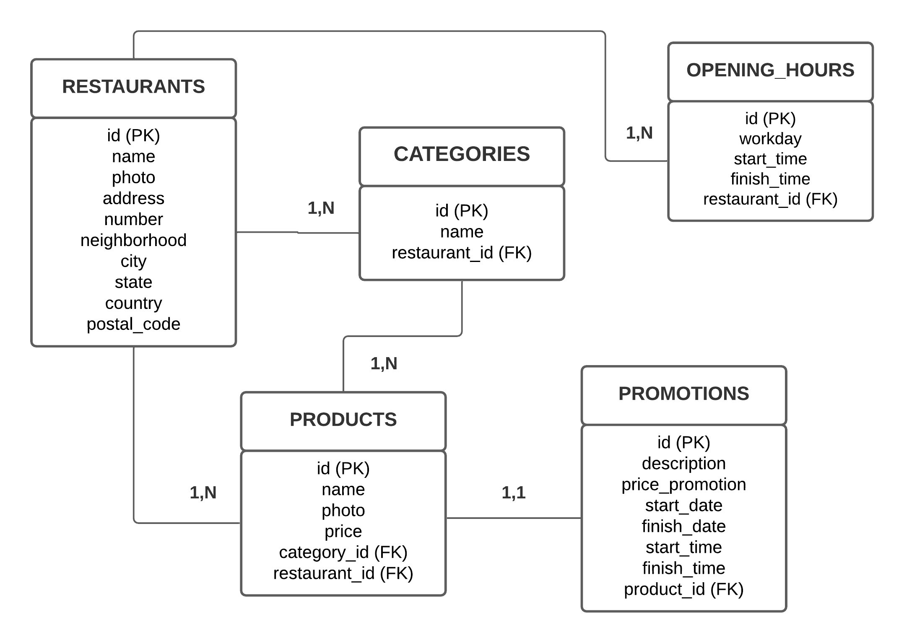
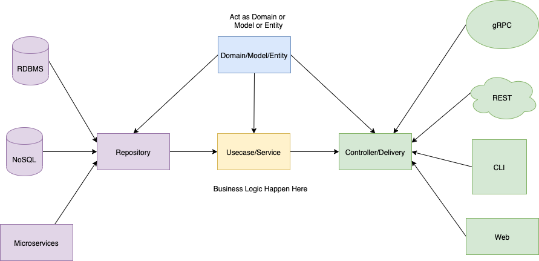

<h1 align="center">Goomer Lista Rango</h1>

<p align="center">API RESTful capaz de gerenciar os restaurantes e os produtos do seu cardápio.</p>
<hr>
<br>

### ✨ Features
- [x] Listar todos os restaurantes
- [x] Cadastrar novos restaurantes
- [x] Listar os dados de um restaurante
- [x] Alterar os dados um restaurante
- [x] Excluir um restaurante
- [x] Listar todos os produtos de um restaurante
- [x] Criar um produto de um restaurante
- [x] Alterar um produto de um restaurante
- [x] Excluir um produto de um restaurante


<br>

### 📦 Pré-requisitos

- Antes de começar, você vai precisar ter instalado em sua máquina [Docker](https://docs.docker.com/) versão >= 20.10.7 e [Docker Compose](https://docs.docker.com/compose/) versão >= 1.29.2.

<br>

### 🎲 Rodando a aplicação

```bash
# Clonando o repositório
$ git clone https://github.com/strixsoul/goomer-lista-rango.git

# Acessando o diretório
$ cd goomer-lista-rango

# Instalando dependências
$ yarn

# Rodando em desenvolvimento
$ docker-compose up

# Rodando em produção
$ docker-compose -f docker-compose.production.yml up
```
<br>

### 🛠 Tecnologias

As seguintes ferramentas foram usadas na construção do projeto:

- [Node.js](https://nodejs.org/en/)
- [Docker](https://docs.docker.com/)
- [Docker Compose](https://docs.docker.com/compose/)
- [Postgres](https://www.postgresql.org/)
- [TypeScript](https://www.typescriptlang.org/)
- [Express](https://expressjs.com/pt-br/)
- [Jest](https://jestjs.io/pt-BR//)

<br>

### 🔨 Estrutura

<!--ts-->
  * DER do banco de dados

  <h1 >
    
  </h1>

  * Fluxo da aplicação
    * A estrutura da aplicação é baseada nos conceitos de arquitetura limpa, seguindo o fluxo:
  controller > usecase > repository > storage

  <h1>
    
  </h1>

  <br>

  ###
🧪 Testes unitários

```bash
# Rodando os testes
$ yarn test
```

<br>

* Resultado dos testes, faltando aplicar testes de integração:

<h1>
  
</h1>

- Acesse a cobertura de testes no navegador: goomer_lista_rango/coverage/lcov-report/index.html

<br>

### 🚀 Desafios enfrentados

- Não utilização de ORM foi um desafio devido ao tempo de criação de queries;
- Construir a aplicação e adquirir novos aprendizados em pouco tempo, algo que foi extremamente gratificante pela conquista.

<br>

### 💡 Pontos de melhoria
- Validar intervalo mínimo de 15 minutos para os horários;
- Inserir paginação nas rotas de listagem;
- Comprimir fotos enviadas para consumo mais rápido;
- Enviar fotos para um bucket online de imagens (ex.: Amazon S3);
- Inserir campo para url de imagem;
- Aplicar testes de integração.

<br>

   ###
🙋 Utilidade

- [Rotas Insomnia](https://drive.google.com/file/d/1_PwmFF5rl3zdSRj5YUo9rRZ9WYGMwOlQ/view?usp=sharing)
- [Documentação (disponível localmente)](http://localhost:3333/doc/)

<br>

---

Feito com 💙 por Raquel Silveira

[](https://www.linkedin.com/in/raquel-silveira/)
[](rsilveira136@gmail.com)
